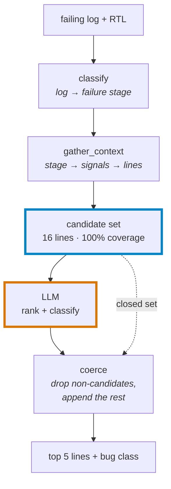

# LLM RTL Bug Localization

Given a failing chip-design simulation log, predict which line of SystemVerilog caused it.
Evaluated against a random-ranking control on 30 injected faults.

**Result: 22%±2 top-1 vs 6%±5 chance.** The classifier is at chance and the second model is too — both reported below.

## Results

Output of `eval/compare_all.py --seeds 100`. Agent rows are 3 seeds at `temperature=0`; ± is the standard deviation across seeds.

| Method | Top-1 | Top-3 | MRR | Rec@5 | Class |
|---|---|---|---|---|---|
| random-in-candidates *(control)* | 6%±5% | 20% | 0.15±0.05 | 34% | 26% |
| regex | 0% | 0% | 0.00 | 0% | 0% |
| single-shot 7B | 7% | 23% | 0.15 | 30% | 33% |
| **agent (Qwen2.5-Coder 7B)** | **22%±2%** | **39%±2%** | **0.31±0.01** | 43%±0% | 26%±2% |
| agent (Llama-3 8B) | 10%±0% | 17%±0% | 0.16±0.00 | 27%±0% | 23%±0% |

Three things to read off this:

- **The control is what makes the table mean anything.** It shuffles each run's own candidate set. Its 6% top-1 matches the arithmetic chance rate for a 16-candidate set (1/16). Read every row against 6%, not 0%.
- **Only the Qwen agent beats it.** Single-shot and Llama-3 are both within ~1σ of chance.
- **Class prediction is at chance for both agents** (26% and 23%, vs 25% for a 4-way guess). Localization works; classification doesn't.

## How it works



A 3-node LangGraph pipeline. The first two nodes are deterministic: `parse_log` turns the failing assertion into a failure stage, then each stage maps to signals whose assignment sites and guard conditions are traced by regex. That produces a closed candidate set — **100% coverage, median 16 lines out of 48**. The LLM's only job is to rank within it; `_coerce` drops anything outside the set, so the model cannot invent a line number.

## Dataset

30 single-line mutants in a SystemVerilog FIFO, simulated with cocotb + Icarus Verilog. 30/30 produce an observable failure. Classes: `operator_flip` (10), `off_by_one` (8), `stuck_at` (7), `wrong_reset` (5).

Fault injection gives exact ground truth for free. The catch: **22 of 30 fail at the same `full` assertion**, so one symptom maps to many root causes. That ambiguity is the ceiling this system runs into.

## Limitations

- n=30, one 48-line FIFO. Single-line bugs only.
- Local 7–8B models only; no frontier model tested.
- Ambiguous assertions cap localization regardless of model quality — the failure-stage prior is sometimes wrong before the model sees anything.
- 1 of 180 agent records came from a fallback path rather than a successful LLM call. Partial backstop padding is not recoverable from the saved files. See [docs/design_note.md](docs/design_note.md).

## Run it

```bash
pip install -r requirements.txt
make eval          # scores committed predictions — no Ollama needed
python demo.py     # single case, log to ranked lines
```

`make all` rebuilds everything from scratch (~2 h, needs Ollama). Every LLM call uses `temperature=0` with a recorded seed; every predictions file records its model and seed.

Full method, the debugging arc, and the fallback audit: [docs/design_note.md](docs/design_note.md).
