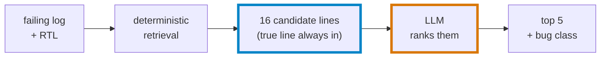

# Agentic RTL Bug Localization

## 1. Problem

Localizing the root cause of an RTL simulation failure is a manual, expertise-heavy task: a
single failing assertion in a testbench can be the symptom of any one of dozens of lines across
the design, and the same assertion often fires for several unrelated bugs. Evaluating an
automated triage method needs labeled data — (failure log, buggy source line, bug class)
triples — but real bug reports rarely come with a verified single-line root cause, and
hand-labeling historical bugs is slow and disputed even among the engineers who wrote the code.

Fault injection sidesteps this. Starting from a known-correct design, single-line mutations of a
known type are applied programmatically, each mutant is simulated against the existing
testbench, and only mutations that actually produce an observable failure are kept. This gives
exact, disputed-by-no-one ground truth (the mutated line and its bug class) for free — at the
cost of only covering the bug types you chose to inject, and only as many mutants as you write.

## 2. Architecture

The agent (`src/agent.py`) is a 3-node LangGraph pipeline. Two of the three nodes are pure,
deterministic code; only the last one calls an LLM, and even that call is constrained by
deterministic post-processing:



`classify` and `gather_context` are the "deterministic retrieval" box above: regex/AST-adjacent
code with no model in the loop. `classify` runs `parse_log` to turn the failing log into a
failure stage; `gather_context` maps that stage to signals (`_stage_signals`) and traces each
one's assignment sites (`ast_trace_signal`) and guard conditions (`find_condition_lines`) to
build the closed `candidate_lines` set. `hypothesize` is the only LLM call, and its only degree
of freedom is re-ordering that fixed set plus naming a bug class. `_coerce` then enforces the
closure: anything the model predicts outside `candidate_lines` is dropped, never emitted.

## 3. Dataset

30 single-line mutants across 4 bug classes, injected into a SystemVerilog FIFO
(`src/fifo.v`) by `src/inject_bug.py`:

| Bug class       | Count |
|-----------------|------:|
| operator_flip   | 10    |
| off_by_one      | 8     |
| stuck_at        | 7     |
| wrong_reset     | 5     |

Each mutant is simulated against the existing cocotb testbench (`tests/test_fifo.py`) via Icarus
Verilog (`iverilog`/`vvp`). 30 mutations were attempted, and 30/30 produce an observable test
failure — none escaped. The testbench checks reset → fill (8 writes) → readback (8 reads) in
that order and aborts at the first failing assertion, so failures cluster into three assertions:

| Assertion                                    | Count | Stage    |
|-----------------------------------------------|------:|----------|
| `Expected full=1 after 8 writes, got 0`       | 22    | FILL     |
| `Expected empty=1 after reset, got 0`         | 5     | RESET    |
| `Read 0: Expected 10, got 00000000`           | 3     | READBACK |

~22 of the 30 runs (73%) fail at the *same* `full` assertion, regardless of bug class or which
line actually caused it — this is the ambiguity the candidate-set retrieval in Section 4 exists
to resolve.

## 4. Method

`gather_context_node` builds a deterministic candidate line set per run: it maps the failure
stage to a fixed union of signals that can plausibly cause that stage's assertion
(`_stage_signals`), then traces each signal's assignment sites (`ast_trace_signal`) and guard
conditions (`find_condition_lines`) via targeted regex over the source — not a full AST walk.

Over the current 30-run dataset, this candidate set has:

- **Coverage: 100%** (30/30) — the true buggy line is in the candidate set for every run.
- **Median size: 16 lines** — out of ~52 lines in `src/fifo.v`, so the model is choosing among
  roughly a third of the file, not the whole thing.

The LLM only re-ranks within this set (Section 2); `_coerce` enforces that its `predicted_lines`
output is filtered to `candidate_lines` before anything is emitted, so a weak or hallucinating
model cannot report a line number that was never a real candidate.

## 5. Results

Both tables below are the verbatim output of `eval/compare_all.py --seeds 100` against the current
dataset. `agent (Qwen2.5-Coder 7B)` and `agent (Llama-3 8B)` are each averaged over 3 seeds
(0, 1, 2) at `temperature=0`; `±` is the standard deviation across those seeds.

**Baseline comparison** (v2 / 16-candidate sets)

| Method | Top-1 | Top-3 | MRR | Rec@5 | Class |
|---|---|---|---|---|---|
| random-in-candidates | 6%±5% | 20% | 0.15±0.05 | 34% | 26% |
| regex | 0% | 0% | 0.00 | 0% | 0% |
| single-shot 7B | 7% | 23% | 0.15 | 30% | 33% |
| agent (Qwen2.5-Coder 7B) (3 seeds) | 22%±2% | 39%±2% | 0.31±0.01 | 43%±0% | 26%±2% |
| agent (Llama-3 8B) (3 seeds) | 10%±0% | 17%±0% | 0.16±0.00 | 27%±0% | 23%±0% |

**Effect of candidate-set expansion**

| Version | Candidate-set size | Coverage | Top-1 | Top-3 | MRR | Rec@5 | Class |
|---|---|---|---|---|---|---|---|
| agent_v1 | 10 | 83% | 17% | 33% | 0.26 | 40% | 30% |
| agent (Qwen2.5-Coder 7B) (3 seeds) | 16 | 100% | 22%±2% | 39%±2% | 0.31±0.01 | 43%±0% | 26%±2% |

> `agent_v1` (`results/predictions_agent_v1_temp0.8.json` — the temperature is in the filename
> for exactly this reason) predates the `temperature=0`/fixed-seed change (Section 8): it was
> generated with Ollama's default sampling temperature (0.8) and no recorded seed, so it is a
> single, non-reproducible run, not a seed-averaged figure like the v2 rows next to it. Its
> numbers should be read as "what one uncontrolled run looked like," not compared statistically
> against the `±` figures elsewhere in this document.

## 6. How to read these numbers

- **The `random-in-candidates` control is what makes this table interpretable.** It shuffles
  each run's own `candidate_lines` and reports the resulting scores — i.e., what you'd get by
  ranking correctly-retrieved candidates in a uniformly random order. Its Top-1 (6%±5%) lines up
  with the arithmetic chance rate for a median-16-line candidate set (1/16 ≈ 6.25%), which is a
  useful sanity check that the control itself is well-calibrated. Every other row should be read
  relative to this one, not to 0%.
- **Only the Qwen agent clearly beats the control.** Its Top-1 (22%±2%) and MRR (0.31±0.01) sit
  well above `random-in-candidates` (6%±5%, 0.15±0.05). Single-shot 7B (7% Top-1, 0.15 MRR) and
  the Llama-3 agent (10%±0% Top-1, 0.16±0.00 MRR) are both within roughly one standard deviation
  of the random control — on this dataset, at this sample size, they are not distinguishable
  from chance ranking of the same candidate set.
- **Class accuracy is at chance for the agent — an honest negative result.** With 4 bug classes,
  chance is 25%. The Qwen agent's class accuracy is 26%±2%; the Llama-3 agent's is 23%±0%.
  Despite localizing lines well above chance, neither model's `predicted_class` output is doing
  better than guessing among 4 labels. The failure-stage prior baked into the prompt (Section 2)
  is not translating into a working classifier.

## 7. Limitations

- **n=30.** Every number above is a rate over 30 runs; the random control's own seed-to-seed
  standard deviation (±5 points on Top-1) is a lower bound on how much noise to expect from
  sample size alone. Category-level breakdowns (e.g. per bug class, 5–10 runs each) are noisier
  still and are not reported here for that reason.
- **One small DUT.** All 30 mutants are single-line edits to one ~52-line synchronous FIFO. Bug
  interactions, multi-line root causes, and larger designs are untested.
- **Local 7–8B models only.** Qwen2.5-Coder (7B) and Llama-3 (8B), run locally via Ollama. No
  larger or frontier model was evaluated, and the two 7–8B models disagree substantially with
  each other (22%±2% vs. 10%±0% Top-1) despite sharing the same candidate sets and prompt.
- **Ambiguous assertions cap localization, independent of model quality.** The FILL-stage `full`
  assertion (Section 3) doesn't only catch fill-logic bugs. Of the 5 `wrong_reset` mutants, 3
  (`bug_005`, `bug_015`, `bug_030` — all wrong resets of `count`) fail the RESET-stage `empty`
  check as expected, but 2 (`bug_016`: `wr_ptr` resets to 1; `bug_017`: `rd_ptr` resets to 1)
  leave `count` resetting correctly to 0, pass the RESET check, and only fail later at the FILL
  stage's `full` assertion. The failure-stage prior the agent is prompted with is therefore
  sometimes wrong about which class of bug it's looking at, before the model does anything at
  all — no amount of ranking within the candidate set fixes a bug whose observable symptom
  points at the wrong stage.

## 8. Reproduction

```bash
source venv/bin/activate

# Regenerate the mutant dataset (mutants + per-case logs + dataset/labels.json)
python src/inject_bug.py

# Baselines
python eval/regex_baseline.py
python eval/single_shot_baseline.py --model qwen2.5-coder:latest --seed 0 --out results/predictions_singleshot_7b.json

# Agent, 3 seeds per model (writes results/predictions_<model>_seed<k>.json)
python eval/run_agent_eval.py --model qwen2.5-coder:latest --repeats 3
python eval/run_agent_eval.py --model llama3:latest --repeats 3

# Random-in-candidates control (100 seeds, sourced from one agent run's candidate_lines)
python eval/random_baseline.py --agent-predictions results/predictions_qwen2.5-coder-latest_seed0.json --seeds 100

# Score one predictions file, or compare everything at once
python eval/evaluate.py results/predictions_qwen2.5-coder-latest_seed0.json --confusion --json results/metrics.json
python eval/compare_all.py --seeds 100
```

All predictions files and `metrics.json` live under `results/`; every script's default output
path already points there, so none of the `--out`/`--agent-predictions` flags above are strictly
required — they're shown for clarity about which file feeds which step.

Every LLM call in `src/agent.py` and `eval/single_shot_baseline.py` is made with `"options":
{"temperature": 0, "seed": <seed>}`, and every prediction in every output file records both
`"model"` and `"seed"` — so any row in Section 5 (other than `agent_v1`, see its footnote) can be
regenerated exactly with the command above and the seed printed in its own filename.
