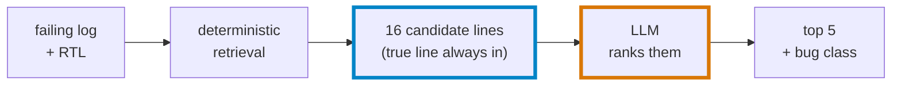

# Design Note: LLM-Assisted RTL Bug Localization

I built a 3-node agent that localizes single-line RTL bugs by having an LLM re-rank a
deterministically-retrieved candidate line set, not free-rank the whole source.
I measured it against three baselines and a random-in-candidates control on a 30-case
fault-injection dataset, across two local 7-8B models and 3 seeds each.
Headline: the best model (Qwen2.5-Coder 7B) reaches 22%±2% Top-1, against 6%±5% for the
random control — roughly 3 standard deviations above chance.

## Problem

Localizing the root cause of an RTL simulation failure is manual and expertise-heavy: a single
failing assertion can implicate dozens of lines, and the same assertion often fires for several
unrelated bugs. Evaluating an automated triage method needs labeled (log, buggy line, class)
data, but real bug reports rarely carry a verified single-line root cause, and hand-labeling
historical bugs is slow and disputed even among the engineers who wrote the code. Fault
injection solves this: mutate a known-correct design one line at a time, simulate each mutant
against the existing testbench, and keep only mutations that produce an observable failure —
exact ground truth, for free.

## Approach

The agent has two deterministic stages and exactly one LLM call. `classify` parses the failure
log into a failure stage (RESET / FILL / READBACK). `gather_context` maps that stage to a fixed
signal list, then traces each signal's assignment sites and guard conditions via targeted regex
to build a closed `candidate_lines` set. The LLM sees this set and the full source, and may only
re-rank within it and name a bug class; a deterministic post-processing step drops any line the
model returns that isn't already a candidate.

## Results

30 mutants, 4 bug classes, cocotb + Icarus Verilog. `agent (Qwen2.5-Coder 7B)` and
`agent (Llama-3 8B)` are each averaged over 3 seeds at `temperature=0`; `±` is the standard
deviation across those seeds.

| Method | Top-1 | Top-3 | MRR | Rec@5 | Class |
|---|---|---|---|---|---|
| random-in-candidates | 6%±5% | 20% | 0.15±0.05 | 34% | 26% |
| regex | 0% | 0% | 0.00 | 0% | 0% |
| single-shot 7B | 7% | 23% | 0.15 | 30% | 33% |
| agent (Qwen2.5-Coder 7B) (3 seeds) | 22%±2% | 39%±2% | 0.31±0.01 | 43%±0% | 26%±2% |
| agent (Llama-3 8B) (3 seeds) | 10%±0% | 17%±0% | 0.16±0.00 | 27%±0% | 23%±0% |

## What the evaluation revealed

The random-in-candidates control — shuffle each run's own candidate set and score the result —
is the load-bearing part of this evaluation, and it changed my conclusions twice.

**First, it invalidated an earlier version's apparent win.** An earlier retrieval pass covered
83% of runs with a median 10-line candidate set, and the agent scored 17% Top-1 — which looks
solid alone. But arithmetic chance on a 10-line set is already 10%, so most of that 17% could be
chance on an easy candidate set, not real ranking. Without a control at that candidate size, I
couldn't tell.

**Second, after closing the retrieval gap** — adding the missing signal and tracing guard
conditions, not just assignments — coverage reached 100% on a harder median-16-line set, and the
Qwen agent's Top-1 (22%±2%) cleared the control (6%±5%) by roughly 3 standard deviations: a real
result, not a control-set artifact.

**Third, the same control shows two negative results.** Single-shot prompting (7% Top-1, 0.15
MRR) and the Llama-3 agent (10%±0% Top-1, 0.16±0.00 MRR) both sit within about one standard
deviation of the control — not distinguishable from chance. Class accuracy is also at chance for
both agents (Qwen 26%±2%, Llama-3 23%±0%, vs. 25% chance for 4 classes): whatever localization
signal the agent has isn't producing a working classifier. I report both as negative results
rather than omitting them.

One prerequisite fix, before any of this was meaningful: at Ollama's default sampling
(temperature 0.8), two runs of the same model on the same 30 cases gave Top-1 scores 10 points
apart (3% vs. 13%). Pinning `temperature=0` and a fixed seed was necessary, not optional, for
these comparisons to mean anything.

## Fallback audit

Of the 180 agent records (2 models × 3 seeds × 30 cases), 1 came from the exception-handling
fallback in `hypothesize_and_emit_node` rather than a scored LLM response: `bug_005`
(qwen2.5-coder, seed 0) hit an Ollama read-timeout (120s) mid-call. That branch returns the
deterministic `candidate_lines`, truncated to `N_PRED`, as `predicted_lines` — a backstop that
reflects retrieval order, not model judgement — with `predicted_class` forced to `"unknown"`.
The record's `rationale` field preserves the raw exception (`call failed: HTTPConnectionPool(...):
Read timed out.`), so it's identifiable in the saved file, but the LLM's actual ranking for that
case is gone: the backstop stands in for it, not a reconstruction of it. It's 1/180 (0.6%) of
agent records and doesn't move any of the seed-averaged headline numbers beyond rounding.

## Limitations

- **n=30.** Every rate above is over 30 runs; the random control's own seed-to-seed standard
  deviation (±5 points on Top-1) is a lower bound on the noise from sample size alone.
- **One small DUT.** All mutants are single-line edits to one 48-line synchronous FIFO; bug
  interactions, multi-line causes, and larger designs are untested.
- **Local 7-8B models only,** and they disagree substantially with each other (22%±2% vs. 10%±0%
  Top-1) on identical candidate sets and prompts — no larger or frontier model was tried.
- **Ambiguous assertions cap localization independent of model quality**: 2 of 5 wrong-reset
  bugs manifest at the FILL-stage assertion rather than RESET, so the failure-stage prior the
  agent is prompted with is sometimes wrong about the bug class before the model does anything.

## Next

With more time, I'd run the same pipeline against a second, larger DUT to see whether the
candidate-retrieval approach and the Qwen/Llama-3 gap generalize past one small FIFO.
